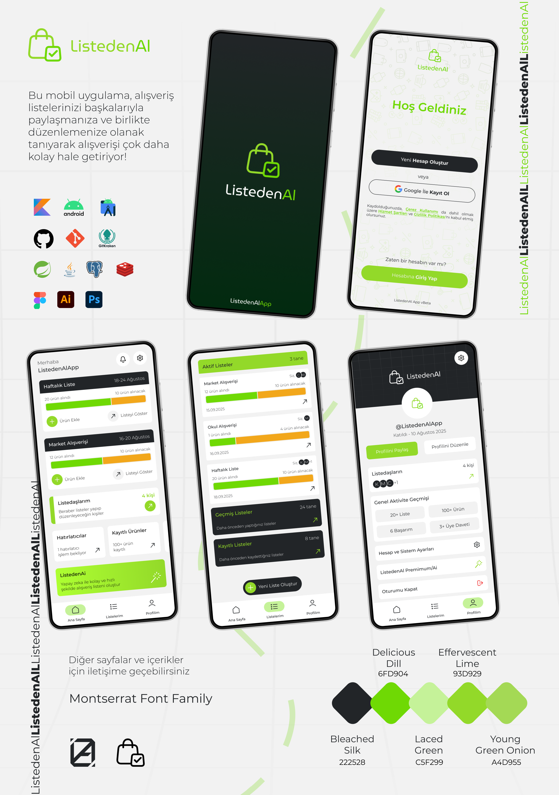

# ListedenAl App

**ListedenAl** is a mobile application that simplifies shopping by enabling users to share and collaboratively edit shopping lists with their loved ones in real-time.



## Features

* **Collaborative Shopping**: Share your shopping list with family and friends.
* **Real-Time Editing**: All participants can add, remove, and edit items on the list.
* **Notifications**: Stay updated with notifications when changes are made to the list.
* **User Authentication**: Firebase authentication for a personalized experience.

## Tech Stack

* **Kotlin**: Main programming language for Android development.
* **Android SDK**: For building and deploying the mobile application.
* **SpringBoot**: For backend services.
* **Java**: For backend API development.
* **PostgreSQL**: For database management.
* **Firebase**: For user authentication and real-time syncing.

## Installation

### Clone the Repository

```bash
git clone https://github.com/zahidayturan/listeden-al-shopping-list-app.git
```

### For Android

1. Open the project in Android Studio.
2. Sync the project with Gradle files.
3. Build and run the project on an Android emulator or device.

### Backend (SpringBoot API)

1. Clone the repository for the API.
2. Run the application using SpringBoot's embedded server.
3. Set up PostgreSQL and Firebase in the application properties.

## Progress

* **Current Status**: The app is still under development, with new features being added regularly.

## Contributing

Feel free to fork the repository, open an issue, or submit a pull request if you'd like to contribute!

## License

This project is licensed under the MIT License.